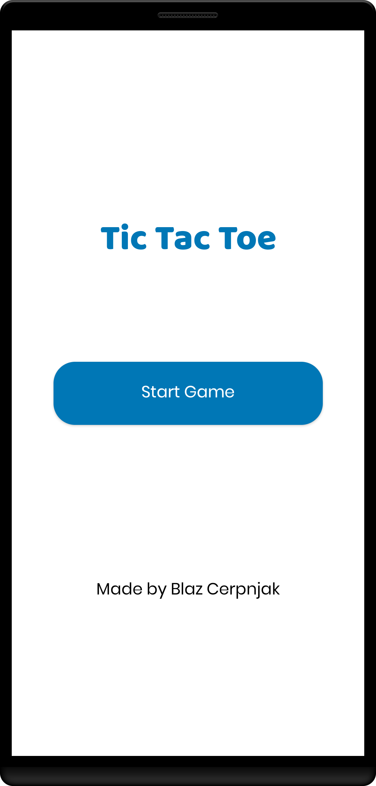
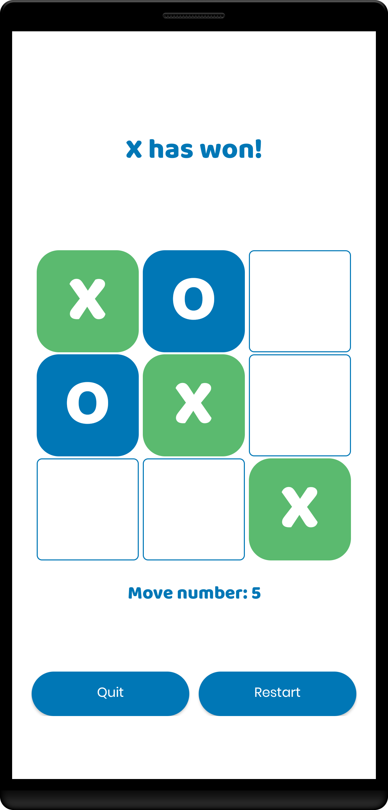

# TicTacToe Android App 

This is a simple example of TicTacToe game as Android app written in Kotlin.

  &nbsp;&nbsp;&nbsp;&nbsp;
  &nbsp;&nbsp;&nbsp;&nbsp;

## Technologies &nbsp;  
This application is being developed in [Android Studio](https://developer.android.com/studio?gclid=CjwKCAiAp8iMBhAqEiwAJb94z6ZmJelUIRcPHgbT2dTslqxP7tYruFIRXo57xC4Q131Nxw0lFSd4fRoCGqcQAvD_BwE&gclsrc=aw.ds). with programming language called [Kotlin](https://kotlinlang.org/).

## Author 👋
This app is being developed by [Blaž Čerpnjak](https://github.com/blaz-cerpnjak), who is currently a student at Faculty of Electrical Engineering, Computer Science and Informatics, University of Maribor.

## Contributing 🧑‍💻
If you found a bug, have an idea how to improve this simple app or have a question, please create new issue or comment existing one.

## My apps
Check out my other apps. You can find them on my profile page.
